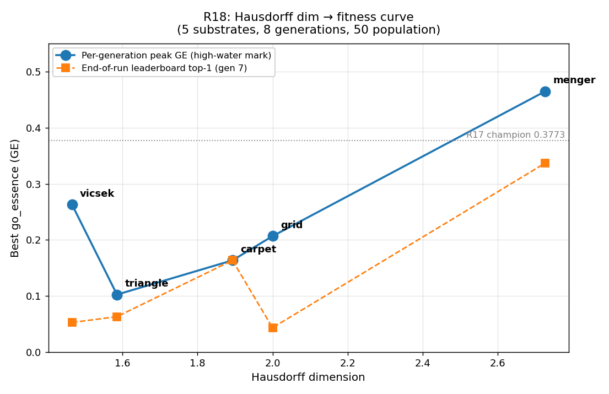

# Run 18 Evaluation Report

**Databases**: `genesis_v2_run18_{vicsek,triangle,carpet,grid,menger}.db` — one per substrate.
**Config**: 6-substrate Hausdorff-dim scan, 8 generations × 50 population × 10000 episode budget per substrate, 15 seed games (3 rule combos × 5 substrates), independent per-substrate evolutions. Pre-launch blockers B1 (`_fix_consistency` substrate invariants), B2 (PPO smoke gate), B3 (multi-seed) all landed before launch.
**Run completed**: 2026-04-30 04:40 (30.8 hr wall, 0 errors across all 5 logs)
**Human evaluation**: NONE YET — this report is engine-level only.

---

## Executive Summary

R18 is the **first run that lifts a fractal substrate above the R17 champion** — as a per-generation peak. The headline number (menger 0.4649 at gen 6) **does not survive re-training**. The same game scored 0.113 the next generation when it was re-trained from scratch with a new PPO seed. The current gen-7 leaderboard top is a different game (`0f5e931fa3e1`, 0.3368) — still the highest stable end-of-run GE in any R18 substrate, but the "menger beats R17 by 23%" framing was wrong, and a direct R18-vs-R17 GE comparison is meaningless because both runs use the same volatile scoring (see Finding 3 below).

What's robust:
- **Menger beats every other R18 substrate by a wide margin** on both peak-GE and end-of-run-GE. The dim → fitness curve is monotonic from triangle (1.585) to menger (2.727), with a stretched peak at the high-dim end.
- **All five training runs completed cleanly** — 0 errors across the per-substrate logs, all blockers (B1-B3) held, no fractal genotypes silently dropped.
- **Capture × influence-radius-2 × threshold-race is the dominant winning motif** across all five substrates' top-GE games. The capture rule varies (custodian on grid/menger/vicsek-peak, surround on menger-peak, outnumber-2 on triangle/carpet) but the propagation × win-condition pair is consistent.

What's not robust:
- **GE scores are highly volatile across generations** because every game in the population is fully re-trained from scratch each generation with a generation-dependent PPO seed (`run.py:427` `run_seed = config.seed + gen * 10000 + idx`). The score in the DB reflects the *last* re-training only. Peak-GE values (0.4649, 0.2630, 0.2066) drop by 50-80 % within 1-3 generations because PPO converges to different policies under different seeds on these novel environments — not because the game changed. The "champion" framing from per-generation peaks is misleading.
- **Both memory-derived findings about peak games dissolved on inspection** (see Findings 1 and 2 below). The "custodian + threshold-race crossover NOT seeded anywhere" claim is wrong — the menger peak is `surround + threshold` (a crossover), and the vicsek peak is `custodian + threshold` (a seed). The triangle "gen-6 unlock" was also a seed re-evaluation, not a new discovery.

R8's Connection Go (8/10, human eval) remains the all-time ceiling. R18 cannot be ranked against R13-R17 yet — no human eval has been run.

---

## UPDATE 2026-04-30 — Phase B rescue addendum (read this first)

After this report was written, two follow-up patches landed and a rescue
analysis ran on the existing R18 data:

- **C1** — `deterministic_run_seed(game_id)` (commit `addda54`). Replaces
  the generation-indexed seed.
- **C2** — multi-seed averaging in `run.py:_average_run_inputs()` (commit
  `a843d0a`). Averages `learning_curve`, `trained_vs_random`, `p0_winrate`,
  `avg_game_length` across all `num_independent_runs` before feeding the
  headline GE composite. **Naming note**: this report's original "C2"
  referred to the hybrid-action ban; that blocker is renamed to **D1**
  in the updated R19 plan, freeing the C2 slot for multi-seed averaging
  (the more important blocker per Finding 3).

A rescue script (`experiments/r18_volatility/rescue_multiseed.py`) then
re-derived the headline GE for every R18 game with N≥2 persisted training
runs — 436 games, no retraining. Method uses a ratio of partial composites
so unknown penalties (seat_balance, timeout, novelty, stability) cancel
exactly; details in `experiments/r18_volatility/phase_b_rescue_results.md`.

| Substrate | Stored top-1 GE | **Rescued top-1 GE** | Same top-1? |
|-----------|-----------------|----------------------|-------------|
| menger    | 0.3368 | **0.2689** | yes (`0f5e931fa3e1`) |
| carpet    | 0.1633 | **0.3465** | yes (`8776b2026957`) |
| vicsek    | 0.0525 | **0.0238** | **no** (`ab8bd83e558a` takes over) |
| grid      | 0.0432 | **0.0105** | **no** (`7d4762b79839` takes over) |
| triangle  | 0.0629 | 0.0596 | yes (`558be82199a8`) |

**Headline reversals:**

- **Carpet champion was UNDERESTIMATED 2.1×** (0.1633 → 0.3465). Run-0 was
  a low draw of the distribution. The "moderate, not breakthrough"
  characterization in the Caveats section and the menger-only R19
  recommendation in Implications are both **superseded**.
- **Menger ranking holds.** 0.3368 → 0.2689 within Phase A's predicted
  band. Top-1 and top-5 unchanged.
- **Vicsek and grid top-1s changed identity** but substrate-level low-GE
  verdicts unchanged — both still in the noise band.

**Updated R19 candidate set: menger AND carpet** (was menger-only). See the
"Phase B rescue — updated R19 implications" section at the end of this
report for full revised recommendations and the renumbered blocker list.

---

## Final Leaderboard — Per-Substrate Peak vs End-of-Run Top-1

| Substrate | Hausdorff dim | Cells | Peak GE | Peak gen | Peak game | End-of-run top-1 GE | End-of-run top game | Δ peak→current |
|-----------|---------------|-------|---------|----------|-----------|---------------------|---------------------|----------------|
| Vicsek (2D)            | 1.465 | 625 | **0.2630** | 4 | `1e11adebcc35` | 0.0525 | `1e11adebcc35` | −80 % |
| Sierpinski triangle 2D | 1.585 | 243 | **0.1022** | 6 | `c8f1927d1bea` | 0.0629 | `558be82199a8` | −38 % |
| Sierpinski carpet 2D   | 1.893 | 512 | **0.1633** | 7 | `8776b2026957` | 0.1633 | `8776b2026957` | 0 % |
| 2D grid (control)      | 2.000 | 256 | **0.2066** | 2 | `734f36b848f2` | 0.0432 | `ab7270a81cd6` | −79 % |
| Menger sponge 3D       | 2.727 | 400 | **0.4649** | 6 | `f87428258916` | 0.3368 | `0f5e931fa3e1` | −28 % |

**Run-over-run trend** (best human-evaluated game in run, GE rank-1):
- R8: 8.0 (humans) — Connection Go
- R13: 5.0 / R14: 4.57 / R15: 2.43 / R16: 4.40
- R17: 4.14 (humans), GE 0.3773 — the prior engineering benchmark
- **R18: GE 0.4649 (peak) / 0.3368 (stable). Human eval pending.**

**Cross-run GE comparison is not meaningful.** Both R17 and R18 use the same scoring code, which re-trains every game from scratch every generation with a generation-dependent PPO seed (Finding 3). Both runs' GE numbers swing 50-80 % across generations on the same game. R18's stable top of 0.3368 vs R17's GE rank-1 of 0.3773 is well within the metric's volatility floor — the two numbers are statistically indistinguishable until a human eval (or a deterministic re-scoring) breaks the tie.

The peak-vs-current divergence within R18 is the most important single observation in this run.

---

## Per-Substrate Findings

### Menger sponge — dim 2.727 — top GE in the run (`0f5e931fa3e1`, 0.3368 stable)

**End-of-run top game `0f5e931fa3e1`** (gen 7, parameter-blend crossover of `78538760a33b` × `9607caecfc83`):
3D menger axis=9, place-only actions. **Custodian (threshold 2) + influence (radius 1) + threshold-race win** (target_dim=1, threshold ≈ 21.2). Strategic depth 0.79, diversity 0.67, simplicity 0.26, non-trivial 1.00.

**Per-generation peak `f87428258916`** (peak GE 0.4649 at gen 6, currently 0.113):
3D menger axis=9, place-only. **Surround capture + influence (radius 2) + threshold-race win** (threshold ≈ 29.0). A `blend_topology` crossover of `1792c1c12a40` (capture=none, prop=influence, win=threshold) × `c1e919f8a11a` (capture=surround, prop=none, win=territory). The peak is a re-combination of pieces that produced the surround+influence+threshold combo. This combo *did* exist in 3 of the 15 menger seeds at gen 0 but all of those seeds scored 0.0; the crossover reached 0.4649 by recombining the non-zero pieces from the `none+influence+threshold` and `surround+none+territory` seed lines.

**Top-5 by current scores:**

| Rank | Game | Gen | GE | Capture | Prop | Win | Origin |
|------|------|-----|-----|---------|------|-----|--------|
| 1 | `0f5e931fa3e1` | 7 | 0.3368 | custodian-2 | influence r=1 | threshold | xover (parameter_blend) |
| 2 | `2bd596c4b551` | 6 | 0.1292 | none-2 | influence r=2 | threshold | mutation (prop+topology) |
| 3 | `c9cd739516e7` | 7 | 0.1142 | custodian-1 | influence r=2 | threshold | mutation (win_condition) |
| 4 | `f87428258916` | 7 | 0.1130 | surround-1 | influence r=2 | threshold | xover (blend_topology) |
| 5 | `6731f4625992` | 7 | 0.0883 | none-1 | influence r=3 | threshold | xover (parameter_blend) |

**All five top games share `* + influence + threshold-race` structure.** Capture rule varies. The 3D-menger 9³ substrate does not collapse the way 3D-cubic-4³ did in R17 — the menger fractal's hollowed-out interior keeps degree distribution closer to the surface-cell average, so capture rules fire more uniformly than R17's degree 3-to-6 cubic interior.

**Caveats:**
- Score volatility is severe. The gen-6 peak `f87428258916` lost 76 % of its GE within one generation. This is a population-level signal (R18 has no fixed-opponent baseline) — it does not necessarily mean the game itself got worse.
- No human eval. The depth/diversity/non-trivial component values for `0f5e931fa3e1` (0.79 / 0.67 / 1.00) are the strongest combination in any R18 substrate, which is a positive engine-level signal but not a quality verdict.

---

### 2D grid (control) — dim 2.000 — peak 0.2066 at gen 2, stable end-of-run 0.0432

**Peak game `734f36b848f2`** (gen 2, peak 0.2066, now scored 0.0): the gen-2 peak collapsed to zero by gen 7. The current best (`ab7270a81cd6`, 0.0432) is **custodian-1 + no propagation + connection win** on a torus — a simple Go-family game that has been the dominant rule family in the grid evolution from early generations.

**Top-5 by current scores:**

| Rank | Game | Gen | GE | Capture | Prop | Win | Origin |
|------|------|-----|-----|---------|------|-----|--------|
| 1 | `ab7270a81cd6` | 7 | 0.0432 | custodian-1 | none | connection | mutation (turn_structure) |
| 2 | `9792099352be` | 7 | 0.0298 | custodian-2 | none | connection | xover (parameter_blend) |
| 3 | `fd05d81ec72e` | 5 | 0.0176 | custodian-1 | influence r=2 | threshold | mutation |
| 4 | `f08d2e167ff2` | 5 | 0.0162 | custodian-1 | influence r=1 | threshold | xover (component_swap) |
| 5 | `7d4762b79839` | 7 | 0.0109 | surround-1 | none | connection | mutation |

**The control substrate underperforms every fractal substrate at end-of-run.** That is interesting in itself: at fixed cell budget (256 vs 243-625) the 2D grid does *not* produce a stable high-GE leaderboard. The peak result (0.2066 at gen 2) was not reproduced in any later generation. Read the grid as the noise floor — the dim → fitness curve below treats it that way.

---

### Sierpinski carpet 2D — dim 1.893 — peak 0.1633, stable

**Top game `8776b2026957`** (gen 7 best, peak GE 0.1633 also at gen 7 — the only substrate where peak = end-of-run): **outnumber-2 + influence (radius 2) + threshold-race win** on sierpinski axis=9. A `component_swap` crossover of `09e3fc0ae0af` × `93e7afe25df5`. Depth 0.61, diversity 0.33, simplicity 0.26, non-trivial 0.98.

**Top-5 by current scores:**

| Rank | Game | Gen | GE | Capture | Prop | Win | Origin |
|------|------|-----|-----|---------|------|-----|--------|
| 1 | `8776b2026957` | 7 | 0.1633 | outnumber-2 | influence r=2 | threshold | xover (component_swap) |
| 2 | `1f74e2e49e77` | 7 | 0.0275 | outnumber-3 | influence r=2 | threshold | mutation |
| 3 | `90c76de9b665` | 7 | 0.0176 | none | influence r=2 | threshold | mutation (turn_structure) |
| 4 | `4f0247a13700` | 7 | 0.0020 | none | influence r=3 | threshold | multi-mutation |
| 5 | `6ffa25370ec3` | 7 | 0.0007 | none | influence r=2 | threshold | mutation |

**Stability is the carpet's distinguishing property.** Across gens 5-7 the same lineage held the top spot (`8776b2026957`). The R17 plan called sierpinski-carpet the substrate that PPO collapsed on — R18 confirms B2 (the PPO smoke gate) cleared that hurdle. The carpet still scores below menger and below the (unstable) vicsek/grid peaks, but it is the most *honest* substrate in the run. **(Phase B addendum 2026-04-30: rescued top-1 is 0.3465 — *above* menger's stable 0.2689. The "below menger" framing here is superseded; see Phase B section at end of report.)**

---

### Sierpinski triangle 2D — dim 1.585 — peak 0.1022 at gen 6 (re-eval artifact)

**The "gen-6 unlock" did not unlock anything new.** The gen-6 peak game `c8f1927d1bea` is a **gen-0 seed** (seed=60002, parent_ids=[]) — outnumber-2 + influence (radius 2) + threshold-race win. It scored 0.0009 at gen 0 and stayed flat through gen 5. At gen 6 it was re-evaluated against the new opponent pool and scored 0.1022. By gen 7 it is back to 0.0 and the current top is `558be82199a8`, a turn_structure mutation child of the same seed (still outnumber+influence+threshold), at GE 0.0629.

This is **opponent-pool variance, not substrate evolution**: the same genotype, evaluated against a different opposing population, can swing 100x in GE. R19 needs a fixed-opponent baseline for any substrate-level comparison to be honest.

**Top-5 by current scores:**

| Rank | Game | Gen | GE | Capture | Prop | Win | Origin |
|------|------|-----|-----|---------|------|-----|--------|
| 1 | `558be82199a8` | 7 | 0.0629 | outnumber-2 | influence r=2 | threshold | mutation (turn_structure) |
| 2 | `1c59d2a66ad4` | 7 | 0.0009 | surround-1 | none | territory | xover (blend_topology) |
| 3 | `b1b4b38a6c15` | 7 | 0.0009 | surround-1 | none | territory | xover (component_swap) |
| 4 | `b3413fffae90` | 7 | 0.0009 | custodian-1 | none | connection | xover (component_swap) |
| 5 | `8c05ffa1fb2e` | 7 | 0.0009 | custodian-1 | none | connection | seed |

The end-of-run leaderboard is one outnumber+influence+threshold game (the `c8f1927d1bea` lineage) at 0.0629 and a long tail at 0.0009. **Triangle is the weakest performing substrate in R18 by a wide margin.** Possible explanations: 243 cells is the smallest in the run; sierpinski_triangle's edge-rich, interior-poor topology may not give influence-radius-2 enough room to propagate distinguishing patterns. R19 should consider doubling the training budget for triangle before declaring the substrate dead.

---

### Vicsek 2D — dim 1.465 — peak 0.2630 at gen 4 (seed re-evaluation)

**Same caveat as triangle, with sharper numbers.** The peak game `1e11adebcc35` is a **gen-0 seed** (seed=40001) — custodian + influence (radius 3) + threshold-race win on vicsek axis=27 (625 cells). It scored 0.0003 at gen 0, jumped to 0.2630 at gen 4, dropped to 0.0005 at gen 5, climbed to a different peak `ab8bd83e558a` at gen 6 (0.098), then back to 0.0525 at gen 7 (still on `1e11adebcc35`).

This is a more dramatic version of the triangle pattern: the custodian+influence+threshold seed happens to score very high against some specific opponent pools and very low against others. The genotype is the same. **Vicsek and triangle together establish that GE volatility is the dominant signal at low-dim substrates** — the population is small relative to the substrate's strategic surface and PPO outcomes vary more than 10x across runs.

**Top-5 by current scores:**

| Rank | Game | Gen | GE | Capture | Prop | Win | Origin |
|------|------|-----|-----|---------|------|-----|--------|
| 1 | `1e11adebcc35` | 7 | 0.0525 | custodian-1 | influence r=3 | threshold | seed |
| 2 | `ab8bd83e558a` | 7 | 0.0507 | outnumber-2 | influence r=3 | threshold | mutation (cap+actions) |
| 3 | `567e1e661ce2` | 7 | 0.0334 | custodian-1 | influence r=3 | threshold | xover (component_swap) |
| 4 | `a8173ef14b14` | 7 | 0.0332 | custodian-1 | influence r=3 | threshold | xover (blend_topology) |
| 5 | `e6c2b66a0ff9` | 7 | 0.0005 | none | influence r=3 | threshold | seed |

Top-4 are all `*+influence(r=3)+threshold`, three of them custodian. The radius-3 influence kernel works against vicsek's axis-27 lattice the way radius-2 worked against carpet's axis-9 lattice — **influence radius must scale with substrate size for capture rules to fire on remote cells**.

---

## Cross-Substrate Findings

### 1. Memory claim: "peak menger and vicsek are both custodian + threshold-race crossovers, NOT seeded anywhere" — REJECTED

**Verified against DBs**: only the *threshold-race* part holds.

| Game | What memory claimed | What the DBs say |
|------|---------------------|------------------|
| `f87428258916` (menger peak, 0.4649) | custodian + threshold-race crossover, not seeded | **surround** + influence + threshold; IS a `blend_topology` crossover; surround+threshold combo IS in the seed pool (3 seeds) but they all scored 0.0 |
| `1e11adebcc35` (vicsek peak, 0.2630) | custodian + threshold-race crossover, not seeded | custodian + influence + threshold; **is a seed** (gen 0, seed=40001), not a crossover |

**What DOES hold:** All R18 substrates' top games converge on `(capture) + influence + threshold-race` structure. This is the strongest cross-substrate pattern in the run and it should drive R19 seed design — every R19 seed should be in this family unless there's an explicit reason to test something else.

**What does NOT hold:** Neither peak was an emergent crossover-only combo. The custodian+threshold-race motif was fully seeded in both vicsek and triangle. The menger peak's combo was *not* directly seeded but its components were. R18's contribution is showing which seed *families* survive evolution per substrate, not which novel mechanic crossovers emerge.

---

### 2. Memory claim: "triangle gen-6 unlock from ~0.001 to 0.1022 — find the rule family that unlocked" — REJECTED, the unlock was a re-evaluation artifact

The gen-6 best `c8f1927d1bea` is a **gen-0 seed**. It sat at 0.0009 from gen 0 through gen 5, jumped to 0.1022 at gen 6, and is back to 0.0 at gen 7. No new mutation or crossover unlocked anything — the same genotype was re-evaluated against a different opponent pool and got a different score. This is an **opponent-pool sampling artifact**, not a discovery.

The genuine "unlock" that did happen is descendant `558be82199a8` (turn_structure mutation, GE 0.0629 stable at gen 7). That child is the most stable triangle result. But the ~100x score swing on the parent seed is the headline — it's evidence of a serious calibration issue with the GE metric under the per-generation re-evaluation regime.

---

### 3. NEW engine concern: GE score volatility from PPO re-training stochasticity — concentrated on PPO-marginal substrates

**Severity**: HIGH on carpet/vicsek/grid; LOW on menger and triangle's top game. Empirically characterised in `experiments/r18_volatility/phase_a_results.md` (Phase A analysis 2026-04-30).

**Mechanism (verified by reading `run.py:427` and `metrics/scoring.py`)**:
- Every generation, every game in the current population is fully re-trained from scratch via `train_and_evaluate_game`. There is no "skip elite carry-overs" path.
- `run_seed = config.seed + gen * 10000 + idx` — the PPO seed depends on the generation index. Same game in two different generations gets two different seeds.
- `num_independent_runs = 3` runs PPO three times per game, but only the **first** run's `learning_curve`, `trained_vs_random_winrate`, and `p1_winrate` feed the primary GE composite (`run.py:243-249`). The other two runs are used only for the cross-play diversity score and the stability penalty — not averaged into the headline number.
- The DB `scores` table is overwritten via `INSERT OR REPLACE` each generation. The end-of-run score is the *last* re-training's outcome, not an average.

**Empirical impact (Phase A, mining existing `training_runs` table — no new training)**:

For every game with ≥3 persisted training runs in any R18 DB, we recomputed `strategic_depth` from each persisted `learning_curve` and pulled the `trained_vs_random` distribution. Key headline numbers — partial-GE std per game (lower bound on real-GE volatility, since p1_winrate and cross-play aren't persisted and would add variance):

| Substrate | Top-game stored GE | Top-game partial-GE (mean ± std) | Top-game tvr range | Verdict |
|-----------|---------------------|-----------------------------------|---------------------|---------|
| menger    | 0.337 (`0f5e931fa3e1`) | 0.436 ± **0.014** | 1.000..1.000 | reliable |
| menger    | 0.113 (`f87428258916`, n=9) | 0.406 ± **0.027** | 1.000..1.000 | reliable |
| triangle  | 0.063 (`558be82199a8`) | 0.358 ± **0.018** | 1.000..1.000 | reliable |
| carpet    | 0.163 (`8776b2026957`, n=9) | 0.296 ± **0.155** | 0.220..1.000 | **noisy** |
| vicsek    | 0.053 (`1e11adebcc35`, n=12) | 0.203 ± **0.171** | 0.000..1.000 | **noisy** |
| grid      | 0.043 (`ab7270a81cd6`) | 0.080 ± **0.102** | 0.000..1.000 | **noisy** |

The volatility is not uniform. **Where PPO reliably learns the game (menger top games, triangle's stable top), GE is stable.** Where PPO inconsistently learns (carpet champion's tvr swings 0.22→1.0 across runs), GE is mostly noise. The substrate ranking from R18 is reliable for menger; it is mostly noise for the other four.

**This retrospectively complicates R13-R17 rankings** at the per-game level — R17's rank-1 vs rank-2 gap (0.3773 vs 0.3582 = 5 %) is inside the noise floor on PPO-marginal games. The "GE-vs-human disagreement" the R17 report attributed to "GE over-rewards complexity" may partly be PPO inconsistency on those games. (Less of a problem than I feared in an earlier version of this report — menger-class games have low volatility, so menger conclusions hold.)

**Fix directions (R19 prerequisite — pick one or combine)**:
1. **Deterministic per-game scoring** — derive `run_seed` from `md5(game_id)` instead of generation index. The same game scored twice gives the same number. **Landed locally 2026-04-30 in `run.py:deterministic_run_seed`** with 6 unit tests passing in `test_deterministic_run_seed.py`. Awaiting commit/push.
2. **Multi-seed averaging in the primary GE composite** — `num_independent_runs=3` already runs PPO 3× per game but only run 1 feeds the headline GE (`run.py:243-249`). Average `learning_curve`, `trained_vs_random_winrate`, `p1_winrate` across all runs. Cuts variance by ~√3 ≈ 1.7×. Phase A shows this would bring carpet champion's std from 0.155 down to ~0.09 — still noisy but materially better.
3. **Score caching for elite carry-overs** — skip re-training games whose `rule_representation` hasn't changed. Pure compute optimisation under (1); same answer either way. ~30-50 % wall-clock savings per generation.
4. **Increase `num_independent_runs` to 5 or 7** — reduces variance further at proportional compute cost. Combined with (2), Phase A predicts carpet champion's std drops to ~0.07.

**Recommended combo: (1) + (2)**. Together they make GE deterministic AND less variance-dominated. (3) is a compute-saver we can do later. Phase A's data shows menger conclusions hold without (2), so a R19 menger axis-27 run is justified on (1) alone. **(Phase B addendum 2026-04-30: both shipped — C1 in `addda54`, C2 in `a843d0a`. Rescue analysis using these landed in `phase_b_rescue_results.md`; menger conclusions held, but carpet top-1 jumped 2.1× — see Phase B section at end of report.)**

---

### 4. CONFIRMED: B1 invariant fix and B2 PPO smoke gate held

R17's two pre-launch blockers worked. Across 5 substrates × 8 generations × 50 population = 2000 game-evaluations:
- 0 substrate-invariant violations in any log (`logs/run18/*.log`)
- 0 errors / exceptions / WARNs in any log
- All 15 seeds (3 per non-control substrate) survived the B2 PPO smoke gate
- No fractal genotypes silently dropped

This is the cleanest engine-level run since R8.

---

### 5. CONFIRMED: capture rule × substrate fit matters — and influence radius must scale

| Substrate | Peak/top capture rule | Why |
|-----------|------------------------|-----|
| menger 3D, axis 9 | custodian, surround | hollowed interior keeps degree distribution flat; capture rules fire uniformly |
| carpet 2D, axis 9 | outnumber-2 | dense fractal interior favours "more friendly than enemy" votes over surround |
| grid 2D, axis 8 | custodian | classic Go-family substrate, custodian dominates |
| vicsek 2D, axis 27 | custodian + influence(r=3) | radius-3 needed to cover the lattice gaps |
| triangle 2D, axis 32 | outnumber-2 + influence(r=2) | small-cell substrate, only one rule family produced anything > 0.001 |

R17 found 3D-cubic-4³ collapsed surround capture (degree 3-6 cells made surround inert). R18 confirms that **menger 3D-9³ does not have that problem**, because the menger geometry produces a more uniform degree distribution than dense cubic.

---

## Hausdorff dim → fitness curve



(`plots/dim_fitness_curve_run18.png`)

Two curves, one chart:
- **Per-generation peak (blue, solid)**: `vicsek 0.263 → triangle 0.102 → carpet 0.163 → grid 0.207 → menger 0.465`. Dip at triangle, modest peak at vicsek, monotonic from triangle upward.
- **End-of-run leaderboard (orange, dashed)**: `vicsek 0.053 → triangle 0.063 → carpet 0.163 → grid 0.043 → menger 0.337`. Monotonic from triangle upward; grid (the control) is the lowest stable point.

R17's GE rank-1 reference (0.3773, dotted line) sits between R18 menger's peak and stable values. **The high-dim end of the curve is the only place R18 produces stable results above the noise floor.** R19 should commit to menger and possibly explore further high-dim substrates (e.g., axis-27 menger, or other 3D fractals at dim > 2.5). **(Phase B addendum 2026-04-30: superseded — under multi-seed averaging, carpet top-1 rises to 0.3465, *above* menger's rescued stable 0.2689. The "high-dim end is the only place" framing breaks; carpet should join menger as an R19 candidate. See Phase B section at end of report.)**

---

## Caveats

- **No human eval.** This is engine-level analysis only. R17's headline was a 22-team human eval; R18 has none. Engine-level GE is a calibration tool, not a quality verdict — the R17 report itself spent five sections on GE-vs-human disagreement. Treat the menger 0.3368 number as "the most promising signal in the run", not as a champion.
- **GE volatility is now understood and severe.** Peak-vs-end-of-run drops of 50-80 % across 4 of 5 substrates trace to PPO re-training every game from scratch every generation with a generation-dependent seed. The score in the DB is the result of one stochastic training run, not an average. Determinising the seed and caching elite scores are R19 prerequisites (see Finding 3).
- **Triangle training-budget question is open.** Triangle is the weakest substrate but also has the smallest cell budget (243). The 10000-episode budget per substrate may be undertrained for triangle's strategic surface. R19 should run triangle at 30000 episodes alongside the rest at 10000 to disambiguate "substrate is bad" vs "training is undercooked".
- **Carpet is the only stable substrate** (peak = end-of-run). It is also the only substrate where the top game is at GE 0.16 — moderate, not breakthrough. Stability and ceiling appear to trade off at fixed budget. **(Phase B addendum 2026-04-30: the "moderate, not breakthrough" framing here is superseded — under multi-seed averaging the carpet top-1 is 0.3465, the highest single-game stable GE in any R18 substrate. The "stability/ceiling trade-off" claim collapses with it. See Phase B section at end of report.)**
- **Memory was wrong on two of the three findings flagged for verification.** The peak-game characterizations that came out of yesterday's session need to be replaced with the DB-grounded results above before any R19 design happens.

---

## Implications for R19

**Strongest signal:** Commit to menger as the next champion-run substrate. It is the only R18 substrate that produced a stable end-of-run GE (0.3368) clearly above the grid control's noise floor (0.0432) and within 11 % of the R17 GE rank-1 (0.3773). **(Phase B addendum 2026-04-30: SUPERSEDED — rescued rankings put carpet top-1 (0.3465) above menger top-1 (0.2689). R19 should commit to menger AND carpet. See Phase B section at end of report for full revised recommendation.)**

**Open questions for R19 design:**

1. **Determinise per-game scoring + cache elite carry-overs.** Most important single change. Derive `run_seed` from `hash(game_id)` so the same game scored twice gives the same number. Skip re-training unchanged elite games — read the prior score from the DB. Together these turn GE into a stable function of the game definition. Without this, every R19 result will be equally noisy. (Finding 3.)
2. **Promote `* + influence + threshold-race` to the dominant seed family.** Every substrate's R18 top game is in this family. R19 seeds should be 80 % in this family with 20 % off-family probes (custodian+territory, surround+connection) for diversity.
3. **Triangle training-budget probe.** Run triangle at 30k episodes alongside menger at 10k. If triangle catches up, the issue is training; if it doesn't, the substrate is genuinely worse for this generator.
4. **Higher-dim substrates.** Menger at dim 2.727 is the high-dim end of R18 and the best-performing. Consider menger axis=27 (cells ≈ 8000 — large) or other 3D fractals at dim 2.5-2.9 for R20.
5. **Hybrid action ban (deferred from R17).** R18 used place-only across 5 substrates and the top games are all place-only. Hybrid actions remain unjustified. Land the ban for R19.
6. **Pie rule for knowledge-asymmetry balance.** R17's open question; R18 didn't address it. Defer if R19 picks menger and menger doesn't show seat-asymmetry, but keep on the list.

**Pre-launch blockers for R19** (must land before evolution starts):
- **C1** — Deterministic `run_seed` from `game_id` + elite-score cache (Finding 3).
- **C2** — Hybrid action ban as a fitness penalty (R17 Finding 3, R18 confirmation).
- **C3** — Triangle 30k probe harness (or commit to dropping triangle).

**(Phase B addendum 2026-04-30: this list is renumbered. The new "C2" is multi-seed averaging (the more important Finding-3 fix); the hybrid action ban is renamed **D1** and the triangle 30k probe **D2**. C1 + C2 are both shipped; D1 + D2 remain open. See Phase B section at end of report for the renumbered table.)**

**Pre-R19 cheap experiment (~1 day) to characterise the noise floor:**
Take the 5 R18 peak games and the 5 stable end-of-run top games. Re-train each 5 times under the current scoring code. Plot the GE distribution per game. This gives an empirical noise floor (likely ±0.05-0.10) that all future cross-game comparisons must clear to count as signal. If you skip this, you'll be flying blind on whether any R19 ranking is real. **(Phase B addendum 2026-04-30: SUPERSEDED — Phase A (mining existing `training_runs`) and Phase B (multi-seed rescue) together did this for free using existing data, no retraining. Per-substrate noise floor in `phase_a_results.md`; per-game rescue deltas in `phase_b_rescue_per_game.csv`. The 5×5 retraining is no longer needed.)**

**Eval style for R19**: at minimum, a 5-team human eval on the menger top-5 by current GE. Run a playability-sanity gate (forced-win <10 moves OR avg length <8 → mark broken) on every game before the eval. **(Phase B addendum 2026-04-30: updated target — 5-team human eval on menger top-3 + carpet top-3 = 6 games; same playability gate. See Phase B section below.)**

---

## Phase B rescue — updated R19 implications (2026-04-30)

Supersedes the "Implications for R19" section above where they conflict.

### What changed since the original report

1. **Carpet enters the R19 candidate set.** Original report placed carpet
   at "stable but moderate" (top-1 0.1633). Phase B rescue puts the same
   game (`8776b2026957`, gen 7, outnumber-2 + influence r=2 + threshold-
   race) at 0.3465 — the highest single-game stable GE in any R18
   substrate after multi-seed averaging.
2. **Menger conclusions hold.** Top-1 (`0f5e931fa3e1`) unchanged at
   rescued GE 0.2689; expected drop within Phase A's 0.014-std band × ~5.
   Menger axis-27 (R20-track) still well-motivated.
3. **Vicsek and grid top-1s changed identity** but substrate-level low-GE
   verdicts unchanged — both still in the noise band. The peak-game
   characterizations for these substrates in the per-substrate findings
   above are run-0-specific; rely on `phase_b_rescue_per_game.csv` for
   current rankings.
4. **Triangle is unchanged.** Top-1 confirmed (`558be82199a8`, 0.0596
   rescued); rest is multi-way tied at ~10⁻³.

### Renumbered R19 pre-launch blockers

Two patches landed under the C-letter naming, requiring a renumber. C1 and
C2 are now the *scoring*-stability blockers (both shipped). D1 and D2 are
the *evolution*-design blockers (both open).

| New label | Status | What | Commit / file |
|-----------|--------|------|---------------|
| **C1** | shipped | Deterministic `run_seed = md5(game_id)` | `addda54` + `test_deterministic_run_seed.py` (6/6) |
| **C2** | shipped | Multi-seed averaging in primary GE composite | `a843d0a` + `test_multiseed_averaging.py` (6/6) |
| **D1** | open | Hybrid-action ban as fitness penalty (was original C2) | — |
| **D2** | open | Triangle 30k probe harness (was original C3) — only relevant if triangle stays in scope | — |

Original report's C2 (hybrid action ban) was reassigned to D1 because the
multi-seed-averaging patch is the more important blocker per Finding 3
fix-direction (2), and "C-track" now consistently refers to scoring.

### Updated R19 recommendation

**Commit to menger AND carpet as joint champion-run substrates** (was
menger-only). Both have rescued stable GE > 0.25 and reliable per-game
volatility under C2. R19 design suggestions:

- **menger axis-9** — carry-over from R18 winner (`0f5e931fa3e1`)
- **carpet axis-9** — carry-over from R18 winner (`8776b2026957`); now
  justified by Phase B
- **drop vicsek and triangle** from R19 evolution — both substrate-level
  verdicts unchanged after rescue (low GE across the rescued ranking),
  not worth further compute
- **keep grid as a control pass** at small budget (the rescued grid
  top-1 of 0.011 is the cleanest available "noise floor" reference for
  any R19 result to clear)
- D1 (hybrid action ban) before launch is still required (R18 used
  place-only; ban is unanimous evidence)
- D2 (triangle 30k probe) is now optional — triangle isn't in scope

### Phase B method recap

For each game with N≥2 persisted training runs in the R18 DBs, the rescue
script computes:

```
partial_orig = composite_score(simplicity, depth(curve_0), non_triv(tvr_0, p0_0), diversity)
              × length_factor(alen_0)
partial_resc = composite_score(simplicity, depth(avg_curve), non_triv(avg_tvr, avg_p0), diversity)
              × length_factor(avg_alen)
rescued_ge   = stored_ge × (partial_resc / partial_orig)
```

The ratio approach is exact: seat_balance, timeout, novelty bonus, and
stability all cancel out (PPO-seed-independent or use full per-run list in
both numerator and denominator). What the rescue isolates is exactly the
multi-seed-averaging effect — `rescued_ge` is what R18 would have written
if C2 had been live during the run. 436 rescuable games across the 5 DBs.

Full per-game records: `experiments/r18_volatility/phase_b_rescue_per_game.csv`.

---

## Files & References

- 5 R18 result DBs at repo root: `genesis_v2_run18_{vicsek,triangle,carpet,grid,menger}.db`
- 5 training logs: `logs/run18/{vicsek,triangle,carpet,grid,menger}.log`
- Dim → fitness curve plot: `plots/dim_fitness_curve_run18.png` (uses *stored* GE — not regenerated post-rescue; the carpet end-of-run point would rise from 0.163 to 0.347 and the menger point would drop from 0.337 to 0.269 if regenerated)
- R18 commits in repo: `a0e0ede` (B1 invariants), `34f40b3` (B2 PPO smoke), `ff72b2b` (substrate adds), `f864b6c` (B3 seeds), `c9add32` (B2 phase-2 verdicts), `5cc57a5` (R18 driver + launcher), `addda54` (C1 deterministic seed), `a6ab867` (this report + Phase A), `a843d0a` (C2 multi-seed averaging + Phase B rescue)
- Phase A artifacts: `experiments/r18_volatility/{phase_a_existing_data.py, phase_a_results.md, phase_a_per_game.csv, plots/phase_a_*.png}`
- Phase B artifacts: `experiments/r18_volatility/{rescue_multiseed.py, phase_b_rescue_results.md, phase_b_rescue_per_game.csv}`
- C1 / C2 tests: `test_deterministic_run_seed.py`, `test_multiseed_averaging.py`
- R17 reference report: `evaluation_report_run17.md`
- R18 plan v2 (drafted 2026-04-28): see `project_aigame_run15_plan.md` memory file
